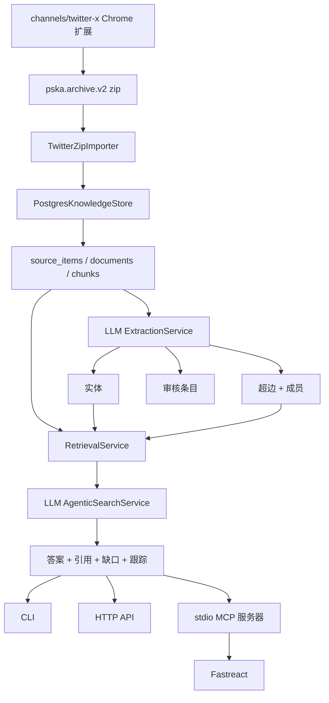

# PSKA MVP 状态

日期: 2026-06-10

## 概述

PSKA 已达到初始私有知识库循环的可运行 MVP：

```text
Twitter/X 归档 zip
  -> pska.archive.v2 / 通道 payload
  -> PostgreSQL + pgvector schema
  -> 来源条目 / 文档 / 分块
  -> LLM 提取
  -> 实体 / 超边 / 审核条目
  -> ACL 优先检索
  -> LLM 代理规划和答案合成
  -> CLI / HTTP API / stdio MCP
  -> Fastreact MCP 工具访问
```

这是一个 MVP，而非生产就绪的完整 PSKA。现在已做出重要架构决策：提取和代理式 QA 需要 LLM。没有针对知识提取或答案合成的基于规则的回退路径。提供程序/配置/schema 失败会被直接暴露为失败，只允许一种恢复路径：要求 LLM 修复其自己的 JSON/schema 输出。

## 完成快照

| 领域 | 状态 | 备注 |
| --- | --- | --- |
| 数据模型 | MVP 完成 | PostgreSQL schema 覆盖用户、团队、空间、来源、文档、分块、记忆、档案卡片、实体、超边、审核条目、审计事件 |
| 隐私模型 | MVP 完成 | 匿名用户/团队 ID、私有优先可见性、团队可见 ACL 字段、`agent_service` 分离建模 |
| Twitter/X 通道 | MVP 完成 | 扩展和 Python schema 发出 `pska.archive.v2`；旧版 zip 导入仅作为兼容路径保留 |
| Zip 导入 | MVP 完成 | 导入当前 `~/Downloads/twitter_archive/*.zip`，保留工件路径，按内容哈希幂等 |
| LLM 提取 | MVP 完成 | 通过 LLM JSON 契约提取实体、超边和审核条目 |
| 超图 | MVP 完成 | 支持具有多个成员和成员角色的关系实例；方向性显式 |
| 检索 | MVP 可用 | ACL 优先词汇/语义占位排名、引用和一跳超图上下文 |
| 代理搜索 | MVP 完成 | LLM 规划检索查询并从检索证据中合成答案 |
| MCP 边界 | MVP 完成 | PSKA 暴露 stdio MCP 工具；Fastreact 加载并调用它们而无需导入 PSKA 内部 |
| HTTP API | MVP 可用 | 本地 API 支持健康、摄入、搜索、代理搜索、提取和审核条目列表 |
| E2E 测试 | MVP 完成 | 真实本地测试覆盖 DB 重置、zip 导入、LLM 提取、搜索、MCP、HTTP 和 Fastreact MCP 加载 |
| 生产就绪 | 未完成 | 需要异步任务、持久任务状态、嵌入、更强的审核工作流、可观察性和 UI |

## 当前架构



## LLM 必需策略

PSKA 现在将这些操作视为 LLM 必需：

- 实体提取
- 超边提取
- 审核条目提议
- 代理检索规划
- 最终答案合成

允许的恢复：

- 如果提供程序返回无效 JSON，PSKA 要求 LLM 将相同输出转换为严格 JSON
- 如果 JSON 有效但违反 PSKA schema，PSKA 要求 LLM 将其重塑为所需 schema

不允许的恢复：

- 没有基于正则/规则的提取回退
- 没有本地启发式答案生成
- 当 LLM 配置失败时，不会静默降级为假答案

## 已实现的接口

CLI：

```bash
PYTHONPATH=src python3 -m pska_core.cli db-reset --name pska_smoke
PYTHONPATH=src python3 -m pska_core.cli --database-url postgresql:///pska_smoke import-twitter-zips
PYTHONPATH=src python3 -m pska_core.cli --database-url postgresql:///pska_smoke extract-all
PYTHONPATH=src python3 -m pska_core.cli --database-url postgresql:///pska_smoke search --query "GitHub"
PYTHONPATH=src python3 -m pska_core.cli --database-url postgresql:///pska_smoke agentic-search --query "GitHub"
PYTHONPATH=src python3 -m pska_core.cli --database-url postgresql:///pska_smoke serve --port 8766
```

HTTP：

- `GET /health`
- `GET /index-status`
- `GET /review-items`
- `POST /ingest/channel-payload`
- `POST /search`
- `POST /agentic-search`
- `POST /extract/all`

MCP 工具：

- `pska_search`
- `pska_agentic_search`
- `pska_index_status`
- `pska_ingest_channel_payload`
- `pska_extract_all`
- `pska_review_items`

Fastreact 将这些视为命名空间工具，例如：

- `pska_pska_search`
- `pska_pska_agentic_search`
- `pska_pska_index_status`

## 已验证的测试证据

单元和契约测试：

```bash
cd "/Users/xudawei/Documents/personal archive/core"
python3 -m pytest -q
# 25 passed

cd "/Users/xudawei/Documents/personal archive/channels/twitter-x"
python3 -m pytest -q
# 9 passed
```

完整真实测试：

```bash
cd "/Users/xudawei/Documents/personal archive/core"
PYTHONPATH=src python3 scripts/e2e_smoke.py
```

真实测试目前验证：

- `pska_smoke` 数据库重置和迁移
- 导入所有当前 `~/Downloads/twitter_archive/*.zip`
- LLM 提取到实体和超边
- 带引用和超图上下文的 CLI 搜索
- 直接 stdio MCP `pska_search`
- 带 LLM 规划和答案合成的 CLI `agentic-search`
- HTTP `/health` 和 `/agentic-search`
- Fastreact 加载 PSKA MCP 工具并调用 `pska_pska_search`

直接文档到图到代理式 QA 演示：

```bash
cd "/Users/xudawei/Documents/personal archive/core"
PYTHONPATH=src PSKA_LLM_API_KEY_FILE="$HOME/api_key.txt" python3 scripts/document_graph_qa_demo.py
```

观察结果：

- 规划笔记成为来源条目和文档
- LLM 提取实体，如 `Project Atlas`、`P-204`、`dependent K`、`Twitter Archive channel` 和 `Review Agent`
- LLM 提取超边，包括 `covers` 和 `depends_on`
- 代理搜索回答：`Policy P-204 covers dependent K during education enrollment.`
- 答案包括回 `Team Planning Note` 的引用

## 已知限制

这些是有意的 MVP 限制，而非隐藏的未完成功能：

- 嵌入仍然是占位符/确定性的足以用于测试；生产语义搜索需要真实的嵌入提供程序和回填作业
- 检索排名仍然是 `lexical_rrf_placeholder`；重排序尚未达到 LLM/交叉编码器质量
- LLM 提取是同步的；真实部署需要作业队列、重试策略、任务状态和部分失败报告
- 审核条目作为数据记录存在，但批准工作流尚未成为完整的产品表面
- HTTP API 是本地且简单的；它还不是经过身份验证的生产服务
- 对话摄入已建模，但尚未连接到真实的聊天日志收集器
- 用户档案卡片和代理记忆存在于模型中；自动提升、衰减和用户拥有的记忆审核仍需要更深入的实现
- 审计表存在，但并非每个写入路径都完全审计检测
- 没有用于浏览来源、图、审核队列或档案记忆的 UI

## MVP 完成定义

当所有这些保持为真时，可以认为初始 PSKA MVP 在功能上完成：

- 通道可以生成规范的来源归档
- PSKA 可以将这些归档摄入 Postgres
- PSKA 可以保留原始工件并返回引用
- LLM 提取可以创建实体、超边和审核提议
- 检索可以在 ACL 下结合文档分块和图上下文
- 代理搜索可以规划、检索、检查证据并合成答案
- Fastreact 可以通过 MCP 访问 PSKA 而无需导入 PSKA 内部
- 测试和测试可以端到端证明循环

当前状态：此 MVP 定义已满足。

详细的下一阶段 TODO 跟踪在 [`roadmap-todo-zh.md`](roadmap-todo-zh.md)。

## 下一阶段优先级

1. 真实嵌入管道

   添加嵌入提供程序配置、批量回填、向量搜索质量测试和重新索引命令。

2. 异步摄入和提取作业

   将 zip 导入和 LLM 提取从同步 CLI 工作转换为具有重试、状态和错误检查的持久作业。

3. 审核和批准工作流

   实现共享、敏感档案更新、记忆提升、实体合并和删除的批准决策。每个决策应写入审计事件。

4. 对话来源摄入

   添加对话/消息来源条目，以便长期 PSKA 记忆不限于文件和 Twitter/X 归档。

5. 档案卡片和代理记忆管理

   添加 LLM 驱动的提议、置信度更新、陈旧记忆处理和用户拥有的审核控制。

6. 检索质量升级

   添加真实混合检索、重排序、冲突搜索、文件查找和代理多步搜索策略。

7. 本地 UI

   构建一个私有本地控制台，用于来源、提取的图、引用、审核队列、记忆卡片和系统运行状况。

## 操作说明

LLM 配置：

```bash
export PSKA_LLM_API_KEY_FILE="$HOME/api_key.txt"
```

密钥文件可能包含：

```text
api-key
model-name
base-url
```

不要将真实密钥、真实用户名、主路径、私有别名或个人标识符提交到仓库配置或示例中。
