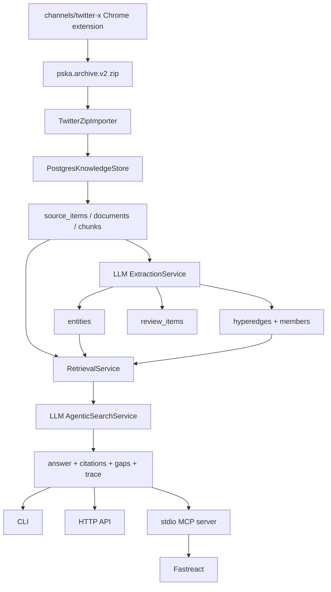

# PSKA MVP Status

Date: 2026-06-10

## Executive Summary

PSKA has reached a runnable MVP for the initial private knowledge-base loop:

```text
Twitter/X archive zip
  -> pska.archive.v2 / channel payload
  -> PostgreSQL + pgvector schema
  -> source item / document / chunks
  -> LLM extraction
  -> entities / hyperedges / review items
  -> ACL-first retrieval
  -> LLM agentic planning and answer synthesis
  -> CLI / HTTP API / stdio MCP
  -> Fastreact MCP tool access
```

This is an MVP, not a production-complete PSKA. The important architectural
decision is now in place: extraction and agentic QA are LLM-required. There is
no rule-based fallback path for knowledge extraction or answer synthesis.
Provider/configuration/schema failures are surfaced as failures, with one
allowed recovery path: ask the LLM to repair its own JSON/schema output.

## Completion Snapshot

| Area | Status | Notes |
| --- | --- | --- |
| Data model | MVP complete | PostgreSQL schema covers users, teams, spaces, sources, documents, chunks, memory, profile cards, entities, hyperedges, review items, audit events. |
| Privacy model | MVP complete | Anonymous user/team IDs, private-first visibility, team-visible ACL fields, `agent_service` modeled separately. |
| Twitter/X channel | MVP complete | Extension and Python schema emit `pska.archive.v2`; legacy zip import remains compatibility-only. |
| Zip import | MVP complete | Imports current `~/Downloads/twitter_archive/*.zip`, preserves artifact paths, is idempotent by content hash. |
| LLM extraction | MVP complete | Extracts entities, hyperedges, and review items through LLM JSON contract. |
| Hypergraph | MVP complete | Supports relation instances with multiple members and member roles; directionality is explicit. |
| Retrieval | MVP functional | ACL-first lexical/semantic placeholder ranking, citations, and one-hop hypergraph context. |
| Agentic search | MVP complete | LLM plans retrieval queries and synthesizes answers from retrieved evidence. |
| MCP boundary | MVP complete | PSKA exposes stdio MCP tools; Fastreact loads and calls them without importing PSKA internals. |
| HTTP API | MVP functional | Local API supports health, ingest, search, agentic search, extraction, and review item listing. |
| E2E smoke | MVP complete | Real local smoke covers DB reset, zip import, LLM extraction, search, MCP, HTTP, and Fastreact MCP load. |
| Production readiness | Not complete | Needs async jobs, durable task state, embeddings, stronger review workflow, observability, and UI. |

## Current Architecture



## LLM-Required Policy

PSKA now treats these operations as LLM-required:

- Entity extraction
- Hyperedge extraction
- Review item proposal
- Agentic retrieval planning
- Final answer synthesis

Allowed recovery:

- If the provider returns invalid JSON, PSKA asks the LLM to convert the same
  output into strict JSON.
- If JSON is valid but violates the PSKA schema, PSKA asks the LLM to reshape it
  to the required schema.

Disallowed recovery:

- No regex/rule-based extraction fallback.
- No local heuristic answer generation.
- No silent degradation to a fake answer when LLM configuration fails.

## Implemented Interfaces

CLI:

```bash
PYTHONPATH=src python3 -m pska_core.cli db-reset --name pska_smoke
PYTHONPATH=src python3 -m pska_core.cli --database-url postgresql:///pska_smoke import-twitter-zips
PYTHONPATH=src python3 -m pska_core.cli --database-url postgresql:///pska_smoke extract-all
PYTHONPATH=src python3 -m pska_core.cli --database-url postgresql:///pska_smoke search --query "GitHub"
PYTHONPATH=src python3 -m pska_core.cli --database-url postgresql:///pska_smoke agentic-search --query "GitHub"
PYTHONPATH=src python3 -m pska_core.cli --database-url postgresql:///pska_smoke serve --port 8766
```

HTTP:

- `GET /health`
- `GET /index-status`
- `GET /review-items`
- `POST /ingest/channel-payload`
- `POST /search`
- `POST /agentic-search`
- `POST /extract/all`

MCP tools:

- `pska_search`
- `pska_agentic_search`
- `pska_index_status`
- `pska_ingest_channel_payload`
- `pska_extract_all`
- `pska_review_items`

Fastreact sees these as namespaced tools, for example:

- `pska_pska_search`
- `pska_pska_agentic_search`
- `pska_pska_index_status`

## Verified Test Evidence

Unit and contract tests:

```bash
cd "/Users/xudawei/Documents/personal archive/core"
python3 -m pytest -q
# 25 passed

cd "/Users/xudawei/Documents/personal archive/channels/twitter-x"
python3 -m pytest -q
# 9 passed
```

Full real smoke:

```bash
cd "/Users/xudawei/Documents/personal archive/core"
PYTHONPATH=src python3 scripts/e2e_smoke.py
```

The real smoke currently verifies:

- `pska_smoke` database reset and migration
- Import of all current `~/Downloads/twitter_archive/*.zip`
- LLM extraction into entities and hyperedges
- CLI search with citations and hypergraph context
- Direct stdio MCP `pska_search`
- CLI `agentic-search` with LLM planning and answer synthesis
- HTTP `/health` and `/agentic-search`
- Fastreact loading PSKA MCP tools and calling `pska_pska_search`

Direct document-to-graph-to-agentic-QA demo:

```bash
cd "/Users/xudawei/Documents/personal archive/core"
PYTHONPATH=src PSKA_LLM_API_KEY_FILE="$HOME/api_key.txt" python3 scripts/document_graph_qa_demo.py
```

Observed result:

- A planning note becomes a source item and document.
- LLM extracts entities such as `Project Atlas`, `P-204`, `dependent K`,
  `Twitter Archive channel`, and `Review Agent`.
- LLM extracts hyperedges including `covers` and `depends_on`.
- Agentic search answers: `Policy P-204 covers dependent K during education enrollment.`
- The answer includes a citation back to `Team Planning Note`.

## Known Limitations

These are intentional MVP limits, not hidden completions:

- Embeddings are still placeholder/deterministic enough for tests; production
  semantic search needs a real embedding provider and backfill jobs.
- Retrieval ranking is still `lexical_rrf_placeholder`; reranking is not yet
  LLM/cross-encoder quality.
- LLM extraction is synchronous; a real deployment needs a job queue, retry
  policy, task status, and partial failure reporting.
- Review items exist as data records, but approval workflow is not yet a full
  product surface.
- HTTP API is local and simple; it is not yet an authenticated production
  service.
- Conversation ingestion is modeled but not yet wired to a real chat log
  collector.
- User profile cards and agent memories exist in the model; automatic promotion,
  decay, and user-owned memory review still need deeper implementation.
- Audit tables exist, but not every write path is fully audit-instrumented.
- No UI for browsing sources, graph, review queue, or profile memory yet.

## MVP Definition Of Done

The initial PSKA MVP can be considered functionally complete when all of these
remain true:

- A channel can produce canonical source archives.
- PSKA can ingest those archives into Postgres.
- PSKA can preserve original artifacts and return citations.
- LLM extraction can create entities, hyperedges, and review proposals.
- Retrieval can combine document chunks and graph context under ACL.
- Agentic search can plan, retrieve, check evidence, and synthesize an answer.
- Fastreact can access PSKA through MCP without importing PSKA internals.
- Tests and smoke can prove the loop end to end.

Current status: this MVP definition is met.

## Next Stage Priorities

1. Real embedding pipeline

   Add embedding provider configuration, batch backfill, vector search quality
   tests, and reindex commands.

2. Async ingestion and extraction jobs

   Convert zip import and LLM extraction from synchronous CLI work into durable
   jobs with retry, status, and error inspection.

3. Review and approval workflow

   Implement approval decisions for sharing, sensitive profile updates, memory
   promotion, entity merges, and deletes. Every decision should write audit
   events.

4. Conversation source ingestion

   Add conversation/message source items so long-term PSKA memory is not limited
   to files and Twitter/X archives.

5. Profile card and agent memory management

   Add LLM-driven proposals, confidence updates, stale memory handling, and
   user-owned review controls.

6. Retrieval quality upgrade

   Add real hybrid retrieval, reranking, conflict search, file lookup, and
   agentic multi-step search policies.

7. Local UI

   Build a private local console for sources, extracted graph, citations,
   review queue, memory cards, and system health.

## Operational Notes

LLM configuration:

```bash
export PSKA_LLM_API_KEY_FILE="$HOME/api_key.txt"
```

The key file may contain:

```text
api-key
model-name
base-url
```

Do not commit real keys, real user names, home paths, private aliases, or
personal identifiers into repository config or examples.
