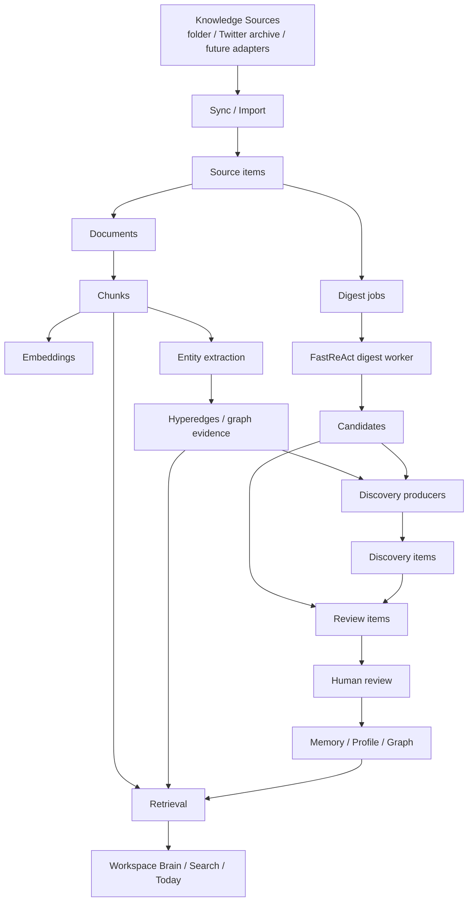

# PSKA Architecture

PSKA has two layers:

- PSKA Core: private-first knowledge substrate, storage, ACL, review, jobs,
  citations, memory, profile, graph, API, and MCP.
- PSKA Workspace: thinking-first UI that presents Today, document/canvas work,
  search, corpus, discoveries, and review flows.

## Data Flow



Ask/RAG is now treated as a dedicated evidence-driven QA pipeline rather than
a single retrieval-plus-prompt step. See
[PSKA Evidence-driven QA Engine](PSKA_EVIDENCE_QA_ENGINE.zh.md) for the
Retrieval -> Evidence Scoring -> Evidence Validation -> Citation Selection ->
Answer Pipeline architecture, audit schema, timeline proposal, and regression
strategy.

## Source Model

The user-facing concept is `Knowledge Source`: a folder, archive inbox, or
future adapter that PSKA is allowed to observe. Connectors are implementation
details behind source adapters.

Config is only a startup/default seed. Runtime source and sync state live in
the database. `files-sync` reads active folder sources, PDF/DOCX/XLSX
extractors, optional legacy XLS extractors, and the workspace Twitter/X archive inbox. It uses content hashes
to avoid repeated work and to detect changed source material.

## Discovery Invariants

`DiscoveryItem` is PSKA's boundary between machine-produced cognition and
durable knowledge governance. It is not a synonym for topic extraction, graph
browsing, or a UI card.

Every discovery workflow must preserve these invariants:

1. Discovery never directly changes long-term knowledge.
   A discovery may become a `ReviewItem`; only approved review application may
   write to Memory, Profile, or Graph state.
2. Discovery must be deduplicable and recomputable.
   Producers assign a stable `fingerprint` from the producer name and the
   semantic claim being made, not from incidental runtime order.
3. Discovery evidence must be frozen for review.
   Reviewers should see the evidence snapshot that justified the discovery at
   production time, even if source documents, chunks, or graph projections later
   change.
4. Discovery quality outranks discovery volume.
   Today should surface only a small set of high-value discoveries. Producer
   count is not a product KPI; reviewer attention is.

The intended governance path is:

```text
DiscoveryItem
  -> ReviewItem
  -> human approve/apply
  -> Memory / Profile / Graph
```

Any path that writes `DiscoveryItem -> Graph` or `DiscoveryItem -> Memory`
directly violates the review governance model.

## Discovery Quality and Ranking

Sprint 5 focuses on quality and ranking before adding more producers. A
candidate generator may create many possible discoveries, but a scorer/ranker
decides which ones are worth interrupting the user for.

`DiscoveryScorer` evaluates:

- novelty
- cross-source evidence
- temporal span
- evidence count and evidence strength
- expected graph or memory impact
- estimated review likelihood

Today applies a quality threshold before showing discoveries. Low-scoring
producer output remains persisted for audit and debugging, but it should not
consume user attention.

Topic extraction by itself is corpus metadata. A topic becomes a discovery only
when it identifies a new relationship, conflict, pattern, decision, or risk.

## Runtime Processes

`./scripts/pska local-daemon` supervises:

- `pska-service`: HTTP API on `127.0.0.1:8765`
- `pska-job-worker`: local durable job worker
- `pska-digest-scheduler`: checks for new or changed sources and creates digest backlog jobs

The frontend runs separately through Vite on `127.0.0.1:5173`. `./start.sh`
starts both the backend supervisor and frontend dev server.

For enterprise/SaaS access, the browser should enter through PSKA Gateway
rather than raw Vite or the raw PSKA API. The gateway serves the built
frontend, redirects unauthenticated users to its AuthNode-backed login flow,
stores a signed HttpOnly session cookie, proxies API calls to PSKA, strips
caller-supplied identity headers, and injects AuthNode-issued `aud=pska` JWT
and PSKA tenant/user headers. See
[Enterprise Auth Gateway](ENTERPRISE_AUTH_GATEWAY.zh.md) for the concrete
startup and security contract.

The digest scheduler is an incremental interval loop, not a fixed daily cron.
The default local daemon interval is 300 seconds. Manual `digest-now` performs
sync first and then processes one digest pass. If FastReAct processes a digest
without writing candidates, PSKA exposes diagnostics and fallback review items
instead of silently reporting an empty review queue.

## Main Backend Modules

| Module | Responsibility |
| --- | --- |
| `api.py` | HTTP API, console/workspace endpoints, service routes |
| `cli.py` | CLI commands and local developer workflows |
| `store_postgres.py` | PostgreSQL persistence |
| `retrieval.py` | Lexical/vector/graph retrieval, citations, diagnostics |
| `jobs.py` | Durable jobs, leases, retries |
| `candidates.py` | Candidate write-back from digest/agent workers |
| `review.py` | Approve/reject/apply review items |
| `memory.py` | Agent memories and profile cards |
| `offline_index.py` / `hipporag_index.py` | GraphRAG-inspired offline index |
| `knowledge_sources.py` | User-facing source lifecycle and sync runs |
| `files_connector.py` | Authorized local file sync and manifest reconciliation |
| `local_daemon.py` | Foreground supervisor and status/config helpers |

## Workspace Surfaces

| Surface | Backend support |
| --- | --- |
| Today | `GET /workspace/today/data` |
| PSKA Brain / Ask PSKA | `POST /workspace/ask`, `POST /workspace/ask/stream`, `GET /workspace/corpus/data`; legacy `POST /workspace/search/query` remains for compatibility and diagnostics |
| Writer evidence suggestion | `POST /workspace/writer/suggest` |
| Review | `GET /console/reviews/data`, `/review-items/*` |
| Corpus | `GET /workspace/corpus/data` |
| Ops/Admin | `/console/*` endpoints |

## Product Boundary

PSKA can generate knowledge-operation content:

- digest summaries
- evidence summaries
- review candidates
- memory/profile candidates
- relationship candidates
- cited QA answers

PSKA should not generate or insert user-authored document content by default.
The user writes; PSKA retrieves, connects, explains evidence, and asks for
review before changing long-term memory or graph state.
