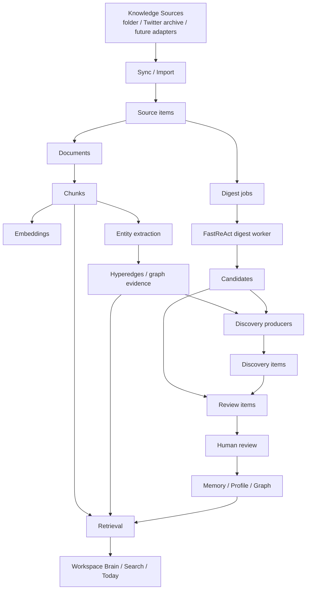

# PSKA Architecture

Status: current architecture contract on `tenant`
Last reviewed: 2026-07-06

This document is the high-level contract for PSKA's current system shape. It
is intentionally paired with the more detailed
[PSKA Evidence-driven QA Engine](PSKA_EVIDENCE_QA_ENGINE.zh.md), the
[ADR index](adr/README.md), and Phase 2 RFCs. If implementation details and an
older planning note disagree, the running code, tests, ADRs, and this document
are the source of truth.

PSKA has two layers:

- PSKA Core: private-first knowledge substrate, storage, ACL, review, jobs,
  citations, memory, profile, graph, API, and MCP.
- PSKA Workspace: thinking-first UI that presents Today, document/canvas work,
  search, corpus, discoveries, and review flows.

## Data Flow



Ask/RAG is now treated as a dedicated evidence-driven QA pipeline rather than
a single retrieval-plus-prompt step. Phase 1 froze the Retrieval -> Evidence
Scoring -> Evidence Validation -> Citation Selection -> Answer Pipeline
contract. Phase 2 adds Evidence Composition between Citation Selection and
Answer Pipeline so multi-document, temporal, graph, and tool-assisted reasoning
can operate on Evidence Sets instead of TopK chunks. See
[PSKA Evidence-driven QA Engine](PSKA_EVIDENCE_QA_ENGINE.zh.md) and
[RFC 0002](rfcs/0002-multi-evidence-composition.md) for the detailed stage
contracts, audit schema, timeline proposal, and regression strategy.

FastReAct owns the agentic loop. PSKA should not introduce a parallel planner
or long-running reasoning loop; it prepares scoped Evidence Sets, exposes
stateless/auditable tools, and validates FastReAct output through the existing
evidence, citation, and answer contracts.

## Source Model

The user-facing concept is `Knowledge Source`: a folder, archive inbox, or
future adapter that PSKA is allowed to observe. Connectors are implementation
details behind source adapters.

Config is only a startup/default seed. Runtime source and sync state live in
the database. `files-sync` reads active folder sources, PDF/DOCX/XLSX
extractors, optional legacy XLS extractors, and the workspace Twitter/X archive inbox. It uses content hashes
to avoid repeated work and to detect changed source material.

## Discovery Invariants

`DiscoveryItem` is PSKA's boundary between machine-produced cognition and
durable knowledge governance. It is not a synonym for topic extraction, graph
browsing, or a UI card.

Every discovery workflow must preserve these invariants:

1. Discovery never directly changes long-term knowledge.
   A discovery may become a `ReviewItem`; only approved review application may
   write to Memory, Profile, or Graph state.
2. Discovery must be deduplicable and recomputable.
   Producers assign a stable `fingerprint` from the producer name and the
   semantic claim being made, not from incidental runtime order.
3. Discovery evidence must be frozen for review.
   Reviewers should see the evidence snapshot that justified the discovery at
   production time, even if source documents, chunks, or graph projections later
   change.
4. Discovery quality outranks discovery volume.
   Today should surface only a small set of high-value discoveries. Producer
   count is not a product KPI; reviewer attention is.

The intended governance path is:

```text
DiscoveryItem
  -> ReviewItem
  -> human approve/apply
  -> Memory / Profile / Graph
```

Any path that writes `DiscoveryItem -> Graph` or `DiscoveryItem -> Memory`
directly violates the review governance model.

## Discovery Quality and Ranking

Discovery work prioritizes quality and ranking before adding more producers. A
candidate generator may create many possible discoveries, but a scorer/ranker
decides which ones are worth interrupting the user for.

`DiscoveryScorer` evaluates:

- novelty
- cross-source evidence
- temporal span
- evidence count and evidence strength
- expected graph or memory impact
- estimated review likelihood

Today applies a quality threshold before showing discoveries. Low-scoring
producer output remains persisted for audit and debugging, but it should not
consume user attention.

Topic extraction by itself is corpus metadata. A topic becomes a discovery only
when it identifies a new relationship, conflict, pattern, decision, or risk.

## Runtime Processes

Integrated PSKA dev verification starts through `./start.sh`. Do not start the
frontend and backend as separate default processes for product acceptance unless
isolated debugging is explicitly requested.

`./scripts/pska local-daemon` supervises:

- `pska-service`: HTTP API on `127.0.0.1:8765`
- `pska-job-worker`: local durable job worker
- `pska-digest-scheduler`: checks for new or changed sources and creates digest backlog jobs

`./start.sh` reads `.pska/config.json`. In the current integrated tenant setup
`startup.frontend.mode` is `gateway`: the script builds the frontend, starts
PSKA Gateway on the configured frontend host/port, serves `frontend/dist`,
proxies API calls to PSKA, redirects unauthenticated browsers to the
AuthNode-backed login flow, stores a signed HttpOnly session cookie, strips
caller-supplied identity headers, and injects AuthNode-issued `aud=pska` JWT
and PSKA tenant/user headers.

Raw Vite mode remains available only as an isolated frontend debugging mode
when `startup.frontend.mode` is set away from `gateway`; it is not the default
integrated verification path. See [Enterprise Auth Gateway](ENTERPRISE_AUTH_GATEWAY.zh.md)
for the concrete startup and security contract.

The digest scheduler is an incremental interval loop, not a fixed daily cron.
The default local daemon interval is 300 seconds. Manual `digest-now` performs
sync first and then processes one digest pass. If FastReAct processes a digest
without writing candidates, PSKA exposes diagnostics and fallback review items
instead of silently reporting an empty review queue.

## Main Backend Modules

| Module | Responsibility |
| --- | --- |
| `api.py` | HTTP API, console/workspace endpoints, service routes |
| `cli.py` | CLI commands and local developer workflows |
| `store_postgres.py` | PostgreSQL persistence |
| `retrieval.py` | Lexical/vector/graph candidate retrieval, hybrid merge, evidence scoring pipeline, diagnostics |
| `embeddings.py` | Embedding providers, including local BGE-M3 integration |
| `citation_pipeline.py` | Citation selection, feature contribution audit, selected spans |
| `evidence_composition.py` | Phase 2 Evidence Set construction from selected citations, slot coverage, composition audit |
| `answer_pipeline.py` | Answer candidate validation, final answer owner selection, no-answer/fallback audit |
| `jobs.py` | Durable jobs, leases, retries |
| `candidates.py` | Candidate write-back from digest/agent workers |
| `review.py` | Approve/reject/apply review items |
| `memory.py` | Agent memories and profile cards |
| `offline_index.py` / `hipporag_index.py` | GraphRAG-inspired offline index |
| `knowledge_sources.py` | User-facing source lifecycle and sync runs |
| `files_connector.py` | Authorized local file sync and manifest reconciliation |
| `local_daemon.py` | Foreground supervisor and status/config helpers |
| `gateway.py` | AuthNode-backed browser gateway and identity boundary |

## Phase 1 Architecture Freeze

Phase 1 freezes the shape of the current evidence-driven Quick Ask pipeline:

```text
Candidate Retrieval
  -> Evidence Scoring
  -> Evidence Validation
  -> Citation Selection
  -> Answer Pipeline
```

This is not a git freeze. It means these stage boundaries and responsibilities
should remain stable while new quality work is added through extension points.

Allowed extension patterns:

- add a generic scorer to an existing score pipeline
- add a generic validator to a validation pipeline
- add a selector/extractor implementation behind an existing stage contract
- add audit fields using the unified stage-audit envelope
- propose a new stage or boundary through an RFC before implementation

Review checklist:

- Does the new logic depend on a specific industry, company, document, sample
  corpus, or benchmark question? If yes, it violates the architecture unless it
  can be re-expressed as a general scorer, validator, selector, extractor, or
  prompt pattern.
- Does it preserve tenant/user/KB/document scope?
- Does it make its decision observable through audit output?
- Can its core behavior be tested without a paid LLM call?
- Does it avoid turning retrieval into planning or multi-evidence reasoning?

Multi-evidence composition, trend questions, comparison questions, and bounded
Deep Ask are Phase 2 capabilities. They should consume Evidence Sets on top of
the frozen Phase 1 pipeline rather than adding retrieval rules for specific
question shapes.

## Workspace Surfaces

| Surface | Backend support |
| --- | --- |
| Today | `GET /workspace/today/data` |
| PSKA Brain / Ask PSKA | `POST /workspace/ask`, `POST /workspace/ask/stream`, `GET /workspace/corpus/data`; legacy `POST /workspace/search/query` remains for compatibility and diagnostics |
| Writer evidence suggestion | `POST /workspace/writer/suggest` |
| Review | `GET /console/reviews/data`, `/review-items/*` |
| Corpus | `GET /workspace/corpus/data` |
| Ops/Admin | `/console/*` endpoints |

## Product Boundary

PSKA can generate knowledge-operation content:

- digest summaries
- evidence summaries
- review candidates
- memory/profile candidates
- relationship candidates
- cited QA answers

PSKA should not generate or insert user-authored document content by default.
The user writes; PSKA retrieves, connects, explains evidence, and asks for
review before changing long-term memory or graph state.
