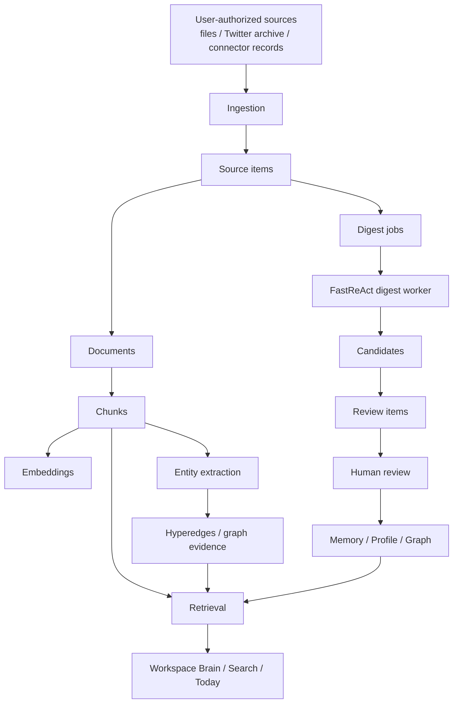

# PSKA Architecture

PSKA has two layers:

- PSKA Core: private-first knowledge substrate, storage, ACL, review, jobs,
  citations, memory, profile, graph, API, and MCP.
- PSKA Workspace: thinking-first UI that presents Today, document/canvas work,
  search, corpus, discoveries, and review flows.

## Data Flow

## Runtime Processes

`./scripts/pska local-daemon` supervises:

- `pska-service`: HTTP API on `127.0.0.1:8765`
- `pska-job-worker`: local durable job worker
- `pska-digest-scheduler`: creates digest backlog jobs from new sources

The frontend runs separately through Vite on `127.0.0.1:5173`. `./start.sh`
starts both the backend supervisor and frontend dev server.

## Main Backend Modules

| Module | Responsibility |
| --- | --- |
| `api.py` | HTTP API, console/workspace endpoints, service routes |
| `cli.py` | CLI commands and local developer workflows |
| `store_postgres.py` | PostgreSQL persistence |
| `retrieval.py` | Lexical/vector/graph retrieval, citations, diagnostics |
| `jobs.py` | Durable jobs, leases, retries |
| `candidates.py` | Candidate write-back from digest/agent workers |
| `review.py` | Approve/reject/apply review items |
| `memory.py` | Agent memories and profile cards |
| `offline_index.py` / `hipporag_index.py` | GraphRAG-inspired offline index |
| `files_connector.py` | Authorized local file sync |
| `local_daemon.py` | Foreground supervisor and status/config helpers |

## Workspace Surfaces

| Surface | Backend support |
| --- | --- |
| Today | `GET /workspace/today/data` |
| PSKA Brain | `POST /workspace/search/query`, `GET /workspace/corpus/data` |
| Writer evidence suggestion | `POST /workspace/writer/suggest` |
| Review | `GET /console/reviews/data`, `/review-items/*` |
| Corpus | `GET /workspace/corpus/data` |
| Ops/Admin | `/console/*` endpoints |

## Product Boundary

PSKA can generate knowledge-operation content:

- digest summaries
- evidence summaries
- review candidates
- memory/profile candidates
- relationship candidates
- cited QA answers

PSKA should not generate or insert user-authored document content by default.
The user writes; PSKA retrieves, connects, explains evidence, and asks for
review before changing long-term memory or graph state.
