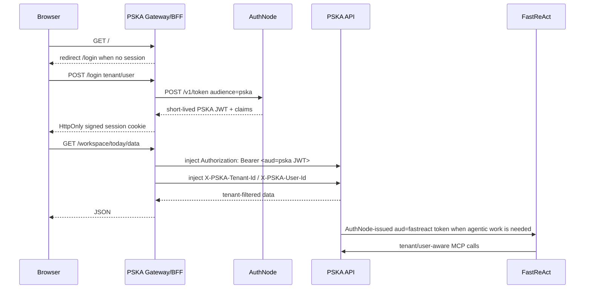

# PSKA 企业认证网关

本文描述 PSKA 在 AuthNode/FastReAct 统一多租户身份体系下的正规访问形态。

## 目标

浏览器不直接持有 AuthNode admin token、PSKA service token 或 FastReAct token。用户只访问 PSKA gateway；gateway 负责检查登录状态、向 AuthNode 换取短期 `aud=pska` 身份令牌、保存 HttpOnly session cookie，并把 API 请求代理到 PSKA 后端。

生产形态通常是：



当前 gateway 内置的 `/login` 是本地/开发 token-broker 页面，不是 PSKA 自有密码系统。正式企业部署应把这一段替换为 AuthNode/OIDC 的 `/authorize -> callback`，但后续接口边界保持一致：gateway 只保存 HttpOnly session，并只向 PSKA 注入 AuthNode 认可的身份。

## 启动

先启动 AuthNode、PSKA 后端和可选 FastReAct。三个服务仍然独立启动，不互相读取对方仓库里的本地配置文件。

PSKA 后端建议使用 JWT 模式：

```bash
export PSKA_AUTH_MODE=jwt
export AUTHNODE_JWT_SECRET='<same-secret-as-authnode>'
export PSKA_AUTH_JWT_SECRET="$AUTHNODE_JWT_SECRET"
export PSKA_AUTH_JWT_ISSUER=authnode.local
export PSKA_AUTH_JWT_AUDIENCE=pska
./scripts/pska --config .pska/config.json serve
```

构建前端并启动 gateway：

```bash
cd frontend
npm run build
cd ..

export AUTHNODE_URL=http://127.0.0.1:8788
export AUTHNODE_ADMIN_TOKEN='<server-side-authnode-admin-token>'
export PSKA_GATEWAY_SESSION_SECRET='<random-long-secret>'

./scripts/pska --config .pska/config.json gateway \
  --host 127.0.0.1 \
  --port 8080 \
  --pska-url http://127.0.0.1:8765
```

打开：

```text
http://127.0.0.1:8080/
```

本地也可以让 `./start.sh` 直接把常用前端端口 `5173` 交给 gateway。配置
`.pska/config.json`：

```json
"startup": {
  "frontend": {
    "enabled": true,
    "mode": "gateway",
    "host": "0.0.0.0",
    "port": 5173
  }
}
```

这样打开 `http://127.0.0.1:5173/` 或 LAN 地址上的 `:5173` 时，未登录会由
gateway 自动跳到 `/login`。如果使用 `"mode": "vite"`，`5173` 仍是开发热更新
服务器，不会负责登录跳转。

如果后端仍运行在旧的 `service_token` 模式，gateway 可以临时使用服务端 token 代理：

```bash
export PSKA_GATEWAY_PSKA_SERVICE_TOKEN='<pska-service-token>'
```

这只是兼容路径；企业部署应优先使用 `PSKA_AUTH_MODE=jwt` 或受信任网关下的 `trusted_headers`。

## 浏览器行为

- 未登录访问 `/` 时，gateway 跳到 `/login`。
- 登录后，gateway 设置 `pska_gateway_session` HttpOnly cookie。
- 前端启动时调用 `/auth/session` 读取 tenant/user 摘要，只用于显示和构造本地 UI payload。
- 前端 API 调用仍使用相对路径，例如 `/workspace/today/data`。
- gateway 会丢弃浏览器传来的 `Authorization`、`X-PSKA-*`、`X-FastReAct-*`、`X-AuthNode-*` 和 cookie，再注入 gateway session 中的真实身份。

因此用户不需要手动把 token 填到前端。裸 `http://127.0.0.1:5173` 仍可用于开发热更新，但正规入口应是 gateway 或上游 ingress 暴露的地址。

## 关键环境变量

| 变量 | 用途 |
| --- | --- |
| `PSKA_GATEWAY_HOST` / `PSKA_GATEWAY_PORT` | Gateway 监听地址 |
| `PSKA_GATEWAY_FRONTEND_DIST` | 已构建前端目录，默认 `frontend/dist` |
| `PSKA_GATEWAY_PSKA_URL` | PSKA 后端 URL，默认 `http://127.0.0.1:8765` |
| `PSKA_GATEWAY_AUTHNODE_URL` / `AUTHNODE_URL` | AuthNode URL |
| `PSKA_GATEWAY_AUTHNODE_ADMIN_TOKEN` / `AUTHNODE_ADMIN_TOKEN` | 服务端调用 AuthNode `/v1/token` 的 admin token |
| `PSKA_GATEWAY_SESSION_SECRET` | 签名浏览器 session cookie；生产必须设置 |
| `PSKA_GATEWAY_COOKIE_SECURE` | HTTPS 下设置为 `true` |
| `PSKA_GATEWAY_TOKEN_TTL_SECONDS` | AuthNode 签发的 PSKA JWT TTL |
| `PSKA_GATEWAY_PSKA_SERVICE_TOKEN` | 仅用于兼容旧 PSKA service-token 模式 |

## 安全边界

- AuthNode 只证明用户与租户身份；PSKA 仍负责知识 ACL、tenant filter、review 写入治理。
- Gateway 不是身份源，不存密码，不做组织管理。
- Browser 不能直接拿 AuthNode admin token、PSKA service token 或 FastReAct service token。
- Gateway 的 `/auth/session` 只返回 tenant/user/roles/groups 等摘要，不返回 JWT。
- PSKA 不能信任公网直连传入的 `X-PSKA-*` 头；这些头只在 AuthNode/gateway/loopback 受信任边界内有效。
- 上线前建议在共享 schema + `tenant_id` SQL 过滤之外，再加 Postgres RLS 作为第二道防线。

## 验证

```bash
curl -i http://127.0.0.1:8080/auth/session
```

未登录应返回 `401`。

登录后：

```bash
curl -b cookie.txt -c cookie.txt http://127.0.0.1:8080/auth/session
curl -b cookie.txt http://127.0.0.1:8080/workspace/today/data?owner_user_id=user_primary
```

期望 `/auth/session` 返回 `tenant_id` 和 `user_id` 摘要，workspace API 返回当前 tenant 范围内的数据。
