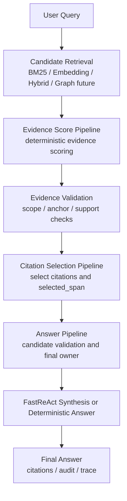

# PSKA Evidence-driven QA Engine 架构

Status: current architecture note on `tenant`
Date: 2026-07-05
Scope: PSKA Quick Ask / RAG evidence pipeline

## 目标

PSKA 的 Ask 链路正在从“Prompt + Retriever + LLM”的 RAG 形态，演进为一条可解释、可审计、可回归的 Evidence-driven QA Engine。核心目标不是让某一个 benchmark 问题短期更准，而是把问答过程拆成职责清晰的阶段，让每一层都能独立调试、替换和回归。

当前设计坚持两个约束：

- 禁止题型优化：不得用行业、公司、样本文档或单个 benchmark 问法写硬编码捷径。
- 允许能力抽象：质量提升必须沉淀为通用 scorer、validator、selector、extractor、prompt pattern 或 audit schema。

## 当前流水线



这条链路对应最近的提交演进：

| Commit | Layer | 主要意义 |
| --- | --- | --- |
| `31c64234` | Table RAG Accuracy | 证明表格证据可以被找出并用于回答。 |
| `cba1be62` | Evidence Validation | 开始区分“检索到”和“可不可信、该不该引用”。 |
| `9a3913e2` | Stage metrics | 引入 Stage 1 / Stage 2 可观测性和通用确定性打分。 |
| `758612a8` | Evidence Score Pipeline | 将 evidence scoring registry 化，避免继续堆 if/else。 |
| `edbb0df2` | Citation Selection Pipeline | 把 citation 从 retrieval 副产品提升为独立决策。 |
| `da575d9a` | Answer Pipeline Audit | 把隐式 fallback if 改成可观测 validator/decision。 |

## Stage 职责

### Candidate Retrieval

责任是产生候选证据集合，而不是决定最终答案。

当前能力：

- lexical retrieval / BM25 fallback
- vector retrieval with local BGE-M3 embedding
- hybrid merge
- scoped source / KB hard scope
- graph-augmented ranking hook
- `stage1_rank`、`stage1_score`、`retrieval_mode` 等 debug 字段

当前 Golden Eval 显示 hybrid candidate generation 已达到 `Hit@10=100%`、`Hit@50=100%`。因此短期不应继续为单个趋势题定制 retrieval rule；趋势题属于 multi-evidence composition。

### Evidence Score Pipeline

责任是对候选证据进行通用、确定性的证据信号打分。

实现入口：

- `core/src/pska_core/retrieval.py`
- `EvidenceScorePipeline`
- `AnchorCoverageScorer`
- `NumericEvidenceScorer`
- `TableEvidenceScorer`
- `ValidationTablePenaltyScorer`

当前输出：

- `evidence_scoring_*`
- `evidence_scoring_delta`
- `stage1_rank`
- backward-compatible `stage2_*` debug key

设计原则：

- scorer 必须是内容中立的 feature，不得绑定特定公司、行业、年份样本或 benchmark 问题。
- 新增能力优先注册 scorer，而不是修改一个大函数。
- 权重未来应支持配置化和 Golden Eval calibration。

### Evidence Validation

责任是决定证据是否可以进入可引用集合。

当前能力：

- tenant/user ACL 由 retrieval 和 store 层保证
- hard scope source / KB 限定
- required anchor check
- missing query anchor drop
- negated context drop
- lexical unsupported drop
- no-answer reasons

当前输出：

- `evidence_check.status`
- `used_citations`
- `dropped_citations`
- `drop_reason`
- `query_terms`
- `query_anchors`
- `required_query_anchors`
- `no_answer_reasons`

后续方向是将 validation 也 registry 化，和 Evidence Scoring / Citation / Answer 保持一致。

### Citation Selection Pipeline

责任是从通过 validation 的 citation 中决定“引用哪几条”和“引用哪一段”。

实现入口：

- `core/src/pska_core/citation_pipeline.py`
- `CitationSelectionPipeline`
- `SupportHitScorer`
- `AnchorCoverageCitationScorer`
- `QueryTermCoverageCitationScorer`
- `NumericAlignmentCitationScorer`
- `EvidenceTextAvailabilityScorer`
- `RetrievalOrderCitationScorer`

当前输出：

- `evidence_check.citation_selection`
- `evidence.citation_selection`
- each citation `citation_selection.score`
- each citation `citation_selection.features`
- each citation `citation_selection.selected_span`

`selected_span` 是 Citation Pipeline 的关键产物。Retriever 决定 chunk，citation selection 决定 chunk 里的可引用片段。后续 Answer Extraction 和 LLM prompt 应优先使用 selected span，而不是把同源背景全部拼回上下文。

### Answer Pipeline

责任是从候选答案中选择最终答案，并解释为什么选择或回退。

实现入口：

- `core/src/pska_core/answer_pipeline.py`
- `AnswerPipeline`
- `NonEmptyAnswerValidator`
- `RequiredValueCoverageValidator`
- `RawEvidenceListingValidator`

当前候选来源：

- FastReAct / agentic final synthesis
- deterministic extraction fallback
- no-answer policy

当前输出：

- `answer_pipeline.pipeline`
- `answer_pipeline.selected_owner`
- `answer_pipeline.selected_status`
- `answer_pipeline.candidates`
- each candidate `validations`

典型决策：

```text
Agentic answer
  -> RequiredValueCoverageValidator
  -> missing_required_values
  -> rejected

Deterministic fallback
  -> validators pass
  -> selected_owner = deterministic_fallback
```

这让原先隐式的 fallback if 变成可审计状态机。

## 统一 Audit Schema

当前各层已经有 audit/debug 输出，但字段还不完全统一。新的 stage 应优先采用统一 envelope；已有字段可以通过 adapter 或兼容字段逐步迁移。

建议的 canonical envelope：

```json
{
  "schema": "pska.pipeline_stage_audit.v1",
  "stage": "citation_selection",
  "pipeline": "deterministic_citation_selection",
  "owner": "pska",
  "decision": "selected",
  "status": "supported",
  "score": 0.42,
  "latency_ms": 2.4,
  "inputs": {
    "candidate_count": 8
  },
  "outputs": {
    "selected_count": 3,
    "dropped_count": 5
  },
  "features": [
    {
      "name": "anchor_coverage",
      "value": 1.0,
      "weight": 0.14,
      "contribution": 0.14
    }
  ],
  "validators": [
    {
      "name": "required_value_coverage",
      "passed": true,
      "reason": "",
      "details": {}
    }
  ],
  "fallback": {
    "from": "fastreact_agentic_service",
    "to": "deterministic_fallback",
    "reason": "missing_required_values"
  }
}
```

Stage-specific payloads can keep detailed fields, but every stage should expose at least:

| Field | Meaning |
| --- | --- |
| `schema` | Audit payload version. |
| `stage` | Logical stage name: retrieval, evidence_scoring, evidence_validation, citation_selection, answer_pipeline. |
| `pipeline` | Concrete implementation name. |
| `owner` | Decision owner: PSKA, FastReAct, deterministic fallback, no-answer policy. |
| `decision` / `status` | Stage outcome. |
| `features` | Weighted scoring signals. |
| `validators` | Boolean validation checks and reasons. |
| `fallback` | Fallback transition if any. |
| `latency_ms` | Stage-local elapsed time. |

## Timeline

Ask response should eventually expose a compact stage timeline in addition to existing `timing.total_ms` and `agent_steps`.

Target shape:

```json
{
  "timeline": [
    {"stage": "retrieval", "status": "complete", "latency_ms": 12.1},
    {"stage": "evidence_scoring", "status": "complete", "latency_ms": 4.3},
    {"stage": "evidence_validation", "status": "supported", "latency_ms": 1.2},
    {"stage": "citation_selection", "status": "selected", "latency_ms": 2.0},
    {"stage": "answer_pipeline", "status": "selected", "latency_ms": 0.5},
    {"stage": "fastreact_synthesis", "status": "succeeded", "latency_ms": 630.0}
  ]
}
```

Timeline 不是日志替代品。它是用户、开发者和企业客户都能理解的 latency and decision summary。

## Regression Strategy

Phase 1 的质量目标应从单一 Hit@1，转为完整链路的可定位回归：

```text
Retrieval PASS
Evidence Scoring PASS
Evidence Validation PASS
Citation Selection PASS
Answer Pipeline FAIL
```

推荐固定指标：

| Layer | Metric |
| --- | --- |
| Retrieval | Hit@1 / Hit@3 / Hit@5 / Hit@10 / Hit@50 |
| Evidence Validation | dropped reason precision, no-answer false positive |
| Citation Selection | citation precision, selected_span precision |
| Answer Pipeline | required value coverage, no-answer correctness, fallback correctness |
| End-to-end | answer precision, citation precision, latency |

默认回归不应调用付费 LLM：

```bash
./scripts/pska-rag-golden-eval --skip-ask --mode hybrid --format text
PYTHONPATH=core/src .pska/venvs/pska-py312/bin/python -m pytest \
  core/tests/test_answer_pipeline.py \
  core/tests/test_citation_pipeline.py \
  core/tests/test_embeddings.py \
  core/tests/test_knowledge_bases.py \
  core/tests/test_product_flows.py \
  core/tests/test_cli.py -q
```

真实 LLM / FastReAct smoke 应作为显式 live check，不进入默认低成本门禁。

## Multi-evidence Composition

`trend_2021_2025_revenue` 这类问题需要多个年份、多个 citation 和计算/比较。它不应通过 retrieval rule 或公司/年报特例解决。

建议归类为后续能力：

- Evidence Set Builder
- Structured QA
- Multi-evidence Answer Extraction
- Deep Ask bounded research loop

短期保持 Golden Eval 中的趋势题为 known gap，用它监控 multi-evidence composition 能力，而不是压迫 Retriever 做题型优化。

## UI Explainability

已有 pipeline 输出已经支持未来 Evidence Inspector 展示：

```text
Citation
Score 0.42
AnchorCoverage +0.14
SupportHits +0.16
NumericAlignment +0.06
Selected span: ...

Answer
Owner deterministic_fallback
Validator missing_required_values rejected agentic answer
```

UI 不需要暴露全部内部字段，但应能回答三个问题：

- 为什么这条证据被引用？
- 为什么某条证据被丢弃？
- 为什么最终答案由 agentic synthesis 或 deterministic fallback 产生？

## Engineering Rules

新增 QA 质量逻辑必须过下面 checklist：

- 是否依赖具体行业、公司、文档类型或题型？如果是，是否能抽象成 scorer、validator、selector、extractor 或 prompt pattern？
- 是否有可观测 audit 字段说明决策原因？
- 是否有单元测试覆盖正常选择、丢弃、fallback 或 no-answer？
- 是否保持 tenant/user/KB scope 不扩大？
- 是否能在不调用付费 LLM 的默认回归里验证核心行为？

## Near-term Work

建议 Phase 1 收尾顺序：

1. 将 `evidence_check` validation 也 registry 化。
2. 将各 pipeline audit 适配到统一 envelope。
3. 给 Ask response 增加 stage timeline。
4. 在 Golden Eval 中加入 Citation Precision、Selected Span Precision、Answer Pipeline outcome。
5. 设计 `EvidenceRecord` 数据结构，逐步替换跨层散落的 dict 传递。

这五步完成后，PSKA 的 Quick Ask 可以被定义为一条完整、可解释、可审计、可回归的企业级问答链路。
